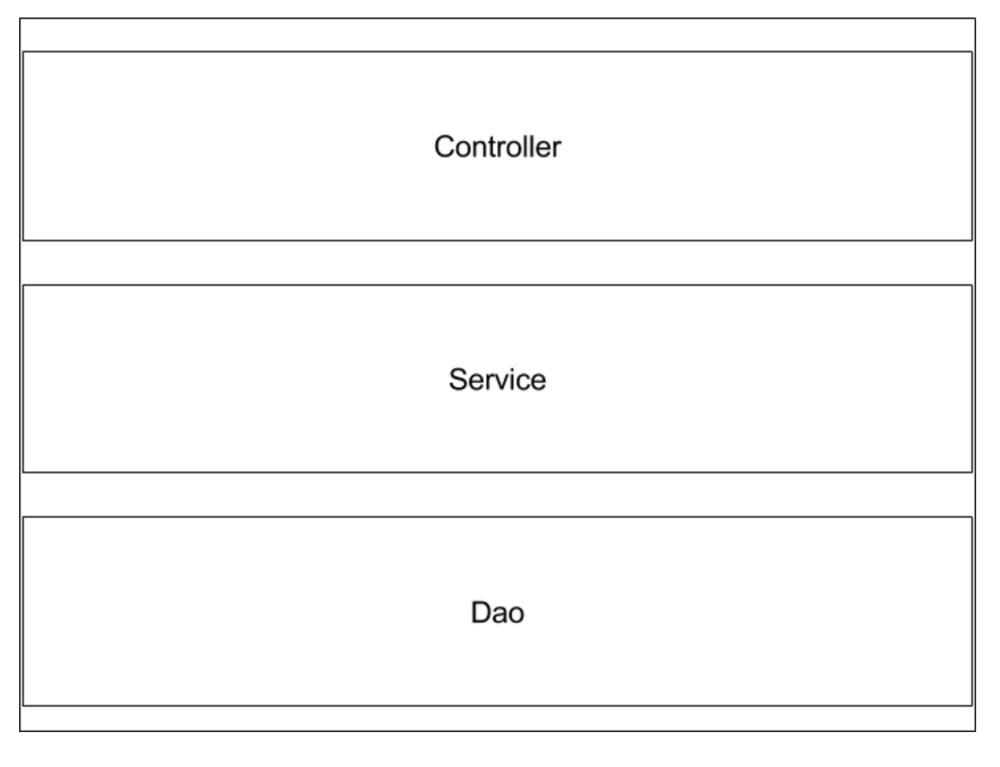
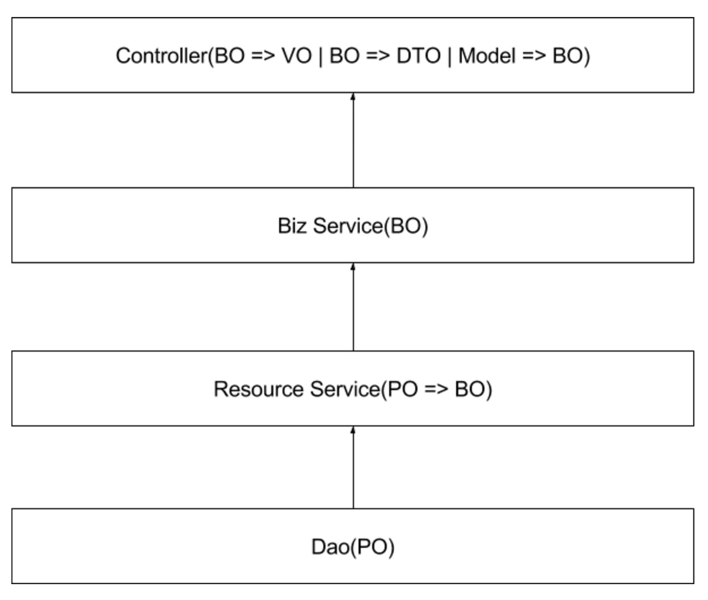
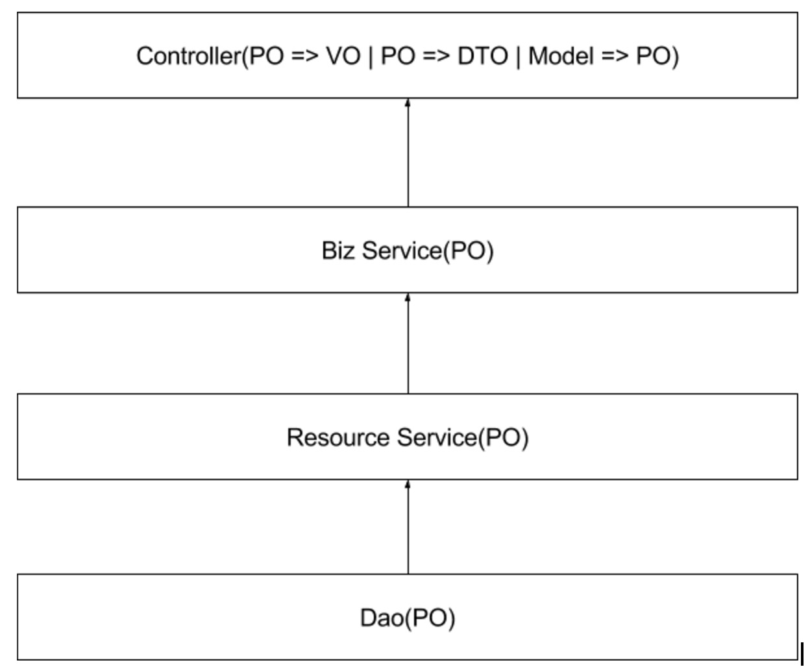

# 引言

网上经常有这样的言论：1.web开发太low，没技术含量。2.web开发根本涉及不到多线程的问题等。对于第一点，我想说技术没有高低贵贱之分，能把自己领域方向做到极致的才是最吊的。对于第二点，谈一下个人对web应用的理解。**web应用的定义：提供http协议支持的应用。**每一个系统都不是封闭的，肯定得和其它系统或者人交互。http协议因为其简单、支持广泛的特性被不同领域的系统作为其输入输出的协议。近几年微服务的出现，越来越多的web应用不再是只输出html页面了。更多的是Restful规范的API接口，json数据格式，以及http协议。所以说，web应用既然有这么多的应用场景，肯定有复杂的系统涉及到多线程问题。
本文要讲述的是如何开发规范Java Web应用。规范包括：如何分层、每一层的职责、层之间如何交互、数据如何流通等。我相信大部分人都知道怎么实现一个功能，也知道最简单的三层模型Controller、Service、Dao。以及数据模型对象：VO,BO,PO,DTO,Model。但是，我以及我身边很多的开发其实并不是非常清楚每个组件的定义和职责。所以本文的目标就是理清楚这些概念、组件。

# 分层
典型的web应用分为三层，即：Controller层、Service层、Dao层。如下图所示：

## controller
Controller层，我认为是系统的Facade。职责包括以下几点：
* 接收系统输入
* 数据校验
* 协议转化
* 系统输出
* 定义系统接口

### 接收系统输入
常见的包括从request中提取path variable，query param，request payload、用户认证信息等。

### 数据校验
基本的数据校验包括：数据类型，数据取值范围、数据格式。举个例子，假设有一个转账接口，其中有一个金额字段。这里对金额字段做的校验包括：不能为负数。而业务型的检查包括金额不能大于账户余额、不能大于账户类型所对应的最大转账额度不应该放在Controller层进行校验。

### 协议转化
协议转化包含两个方面。
1. 系统内部数据类型转化
2. 数据内容协议转化
3. 数据传输格式协议转化

**系统内部数据类型转化**
包括：BO转化成DTO、BO转化成VO。这几种数据模型含义下一节会具体讲述。
**数据内容协议转化**
举个例子说明会更加容易理解。假设有一个Open API，功能是返回User信息。这个Open API对A公司开放的信息包括：昵称、头像两个字段，而B公司是本公司的VIP用户，对其开放的信息不仅包含昵称、头像还包括电话、email等隐私信息。在Service层只有一个返回UserBO的接口，UserBO包含用户所有的信息，在Controller层根据不同公司的类型，生成不同的UserDTO，此过程称为数据内容协议转化。
**数据传输格式协议转化**
包括：把对象序列化成json、xml格式数据、html页面等

### 系统输出
把协议转化之后的数据，组装成Http Response输出给外部应用。

### 定义系统接口
一个系统提供了那些能力，则由系统接口决定的。接口包含三部分内容：
* 输入值
* 接口标识：url+http method
* 返回值

## Service层
service层主要负责系统业务逻辑的处理。上面提到的转账金额上限的校验应该放在此层。service层根据业务系统的复杂度又可以划分成多层。以两层为例：
1. 跟数据表一一对应的资源Service层
2. 在资源Service层之上的聚合业务逻辑层

**资源Service层**
一般跟一张表、一个Dao对应。在SOA领域里，把一部分高度内聚的资源作为一个SOA Service，例如UserSerivce，OrderService等。其它应用不应该直接访问User相关的数据库，而应该调用UserService。资源高度内聚，便于管理和控制。在分布式系统如此，在一个系统内部也应该如此。也就是说，一张表也可以作为一个资源，其它的Service不应该直接访问这张表，而应该通过这张表对应的Service来访问。当然，有些时候可以把几张表的资源内聚到一个Service当中。换句话说，Dao不应该到处散落在不同的Service中，访问资源应该调用资源对应的Serivce。资源Service层理论上应该涉及很薄的、跟资源相关的业务逻辑。附加dao一些简单的业务逻辑能力。另外一个职责就是数据类型转换，也就是PO转化为BO，后面会详细讲述。

**聚合业务逻辑层**
这一层是真正核心业务逻辑处理的地方，在资源Service层之上。完全负责处理业务逻辑，不用关心资源访问。

对于系统不复杂的应用来说，大部分的Service其实可以合为一层，有些特别负责的业务逻辑可以单独抽象出一层，切记Service角色要清晰。判断是否清晰最简单的方式就是能否自然的想出Service的名字。另外插一句题外话，很多公司或者书籍提倡面向接口编程，导致一个很常见的现象就是一个Service包含两部分：XXService和XXServiceImpl。这样写好处就是接口和实现分离，接口亦是文档，清晰。坏处就是多了一个类。我们不应该不假思索的按照惯性思维去实践，在刚提到的这种面向接口编程不是完全可取的。接口的本意是可以有多种实现，也就是可能有多个子类。但是上面提到的这种Service基本上都只有一个实现类，那么接口的意义何在？当然并不是说就不需要接口实现分离。我觉得以下情况可以考虑分离：1. 接口可能会有多种实现 2. SOA系统对外提供服务的Facade Service 3. 复杂的系统，框架面向接口编程更逻辑理清楚组件之间的关系。很显然对于大部分的web应用，以上三点并不符合，所以我觉得没必要接口实现分离，多出一个没有意思类实在是很丑。

## Dao层

dao层比较简单，应该只负责和数据库打交道，不应该涉及业务逻辑，只涉及跟数据存储相关的逻辑。

#数据类型
数据模型一般分为以下几种：PO、BO、VO、DTO、Model、POJO。

## PO（persistence object）
持久化对象,一般表示一张表，属性跟表字段一一对应。

## BO （business object）
业务对象，在业务组件中流通的对象。字段集合可能比PO多，也可能比PO少。一个PO可能对应多个BO。

## VO （view object)
视图对象，只用来给前端页面渲染的数据结构。

## DTO （data transaction object）
数据传输对象，在各个系统间传输的对象，一般需要实现Serializable接口。

## Model
表单数据模型，一般对应request payload。

## POJO (plain ordinary Java object)
只用来表示数据类型，游离在系统业务之外的java bean。

# 数据类型和分层结合

理论上每一种数据类型只能在特定的层中出现。
* po => dao层, 资源Service层
* bo => Service层，Controller层
* vo、dto、model => Controller层

如下图所示：

任何的规范都是灵活的，如果按照上面严格执行的话，就会产生很多属性基本一致的类，而且类型转换代码非常机械化。对于大部分简单的系统来说，各个类型之间，字段几乎是完全一致。灵活的做法是下层的对象可以上升到上层，比如某一个资源没有BO，也没有VO，只有PO。也就是说PO存在于Dao，Service和Controller三层。但是反之则不行，例如VO、DTO、Model不应该在Service层出现，更不能在Dao层出现。所以最佳实践则是最少要两层。如下图所示：

另外需要注意一点就是：其它系统的DTO等于自身系统的PO，也就是说上面提到的所有的类型其实是相对于数据流的位置而定的。所以，在Service层流通的DTO其实是PO的角色。但是自身系统对外的DTO就不应该在Service层出现。

# 结语
做任何事情都需要规范，web开发亦是如此。规范的好处是：整洁、易维护、易理解。规范也是每个程序员进阶的必经之路。上述对于分层和数据类型的理解都是个人对于项目开发的思考，可能跟其它规范有出入。规范不是协议，规范是约定并不是强制，只要清晰可实践即可。每个人都可以有自己的规范，但是需要要大部分人所能接受理解。
注：以上分层和类型的称呼只是定义角色，具体系统中使用的叫法可以不一致。只要团队内部约定好即可。

